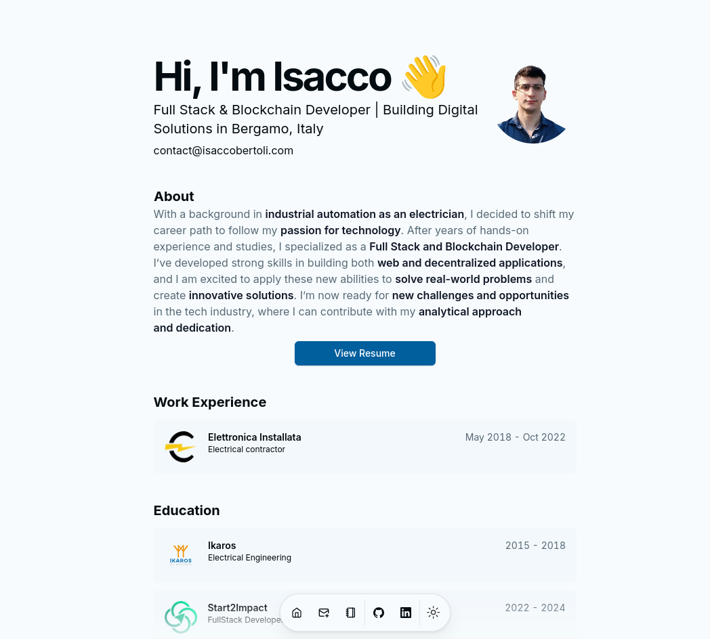
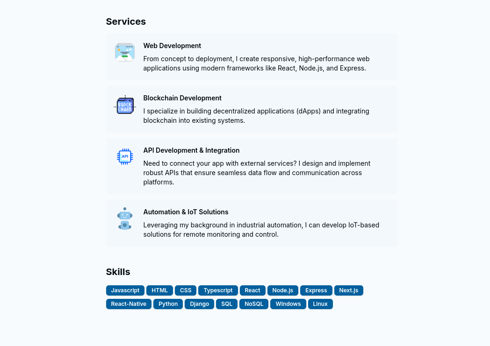
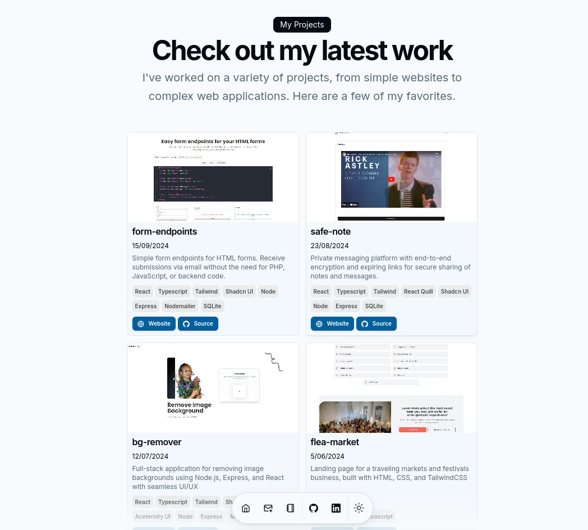
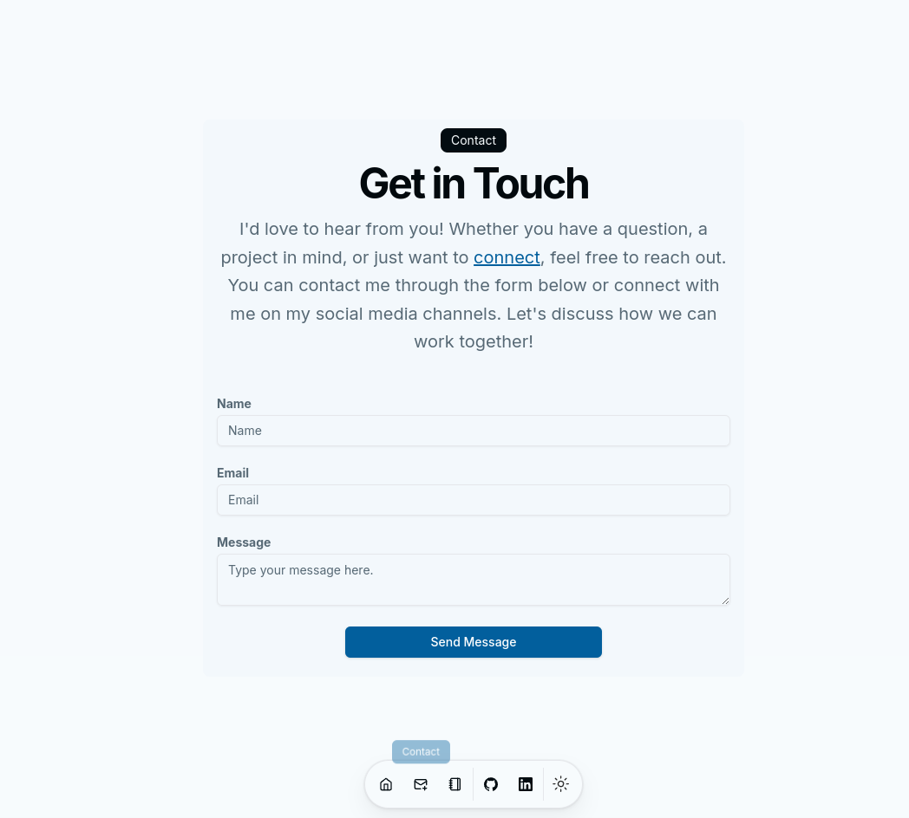

# Portfolio 2024

- This is a fork of https://github.com/dillionverma/portfolio, I just added a few features
- Minimalist developer portfolio using Next.js 14, React, TailwindCSS, Shadcn UI and Magic UI.
- Demo: https://isaccobertoli.com/


## Tech Stack Client

- Next.js
- Tailwind
- Typescript
- Shadcn UI
- Magic UI
- React Markdown


## Images

<div>
    
    
    
    
</div>


## Getting Up and Running Locally

- Clone this repository to your local machine:

```bash
git clone https://github.com/Isacco-B/portfolio-2024.git
```

- Move to the cloned directory

```bash
cd portfolio-2024
```

- Install dependencies

```bash
npm install
```

- Start server

```bash
npm run dev
```

## 🔗 Links

[](https://www.linkedin.com/in/isacco-bertoli-10aa16252/)
